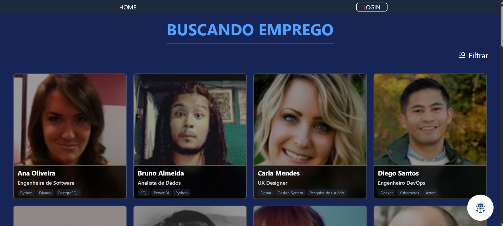
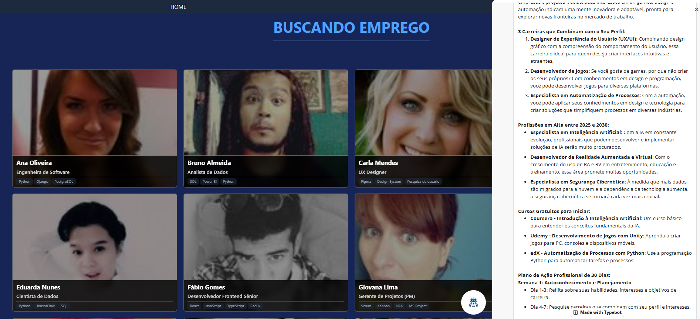
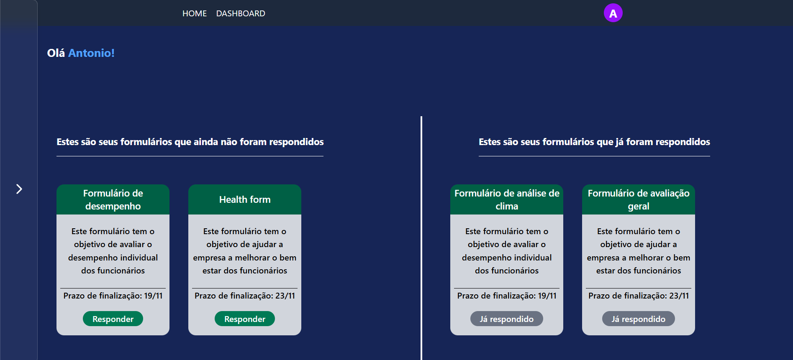
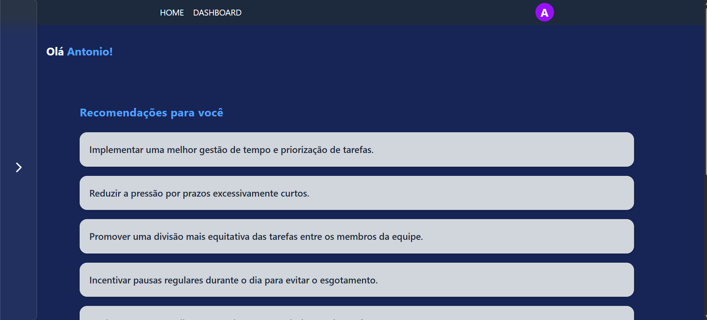
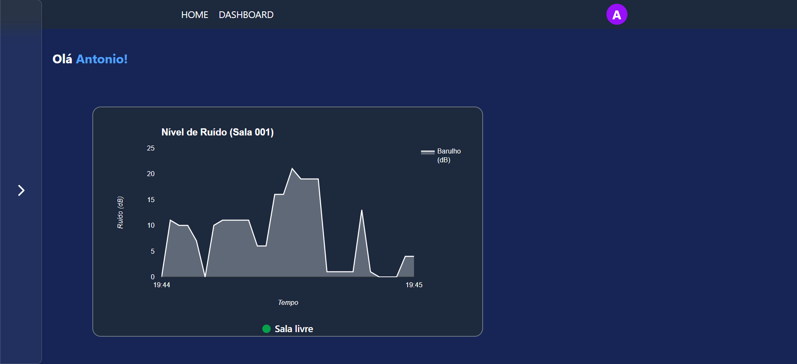
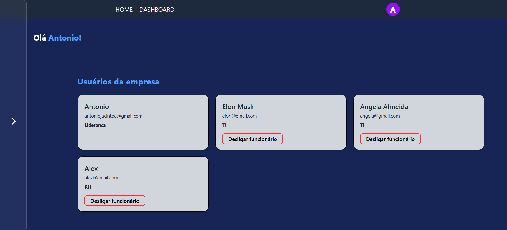

# WorkFlow IA
---
## Integrantes
- Antônio Jacinto (RM: 561777)
- Felipe Bicaletto (RM: 563524)
- Thayná Pereira (RM: 566456)
---

## Resumo do projeto
O WorkFlow IA é um projeto criado com o objetivo de ajudar pessoas a se reintegrar no mercado de trabalho e ajudar empresas a se conectarem mais com seus funcionários, reduzindo o estresse e aumentando o nível de satisfação dos seus colaboradores.

## Reintegração ao mercado
Aqui temos um catálogo de pessoas que estão desempregadas, centralizando pessoas e suas habilidades.


Além disso também temos o nosso assistente virtual para auxiliar em uma possível transição de carreira.

Ele funciona fazendo algumas perguntas e ao término delas, ele te retorna uma análise do seu perfil profissional, retornando três carreiras que mais combinam com você, três carreiras que estarão en akta entre 2025 até 2030, além de um plano de 30 dias para virar um profissional na área.

Para as empresas temos um dashboard, em que colaboradores conseguem responder formulários da empresa, inclusive o Health Form, que é um formulário criado para avaliar o bem estar dos trabalhadores e dar recomendações personalizadas de como melhorar essa situação


Após o preenchimento do Health form, o colaborador pode ver as recomendações no próprio dashboard na área de recomendações


A plataforma também possui integração com um dispositivo IOT que é um sensor de presença e som, que seria posicionado nas salas do escritório. Ele serve para agilizar a vida dos colaboradores, que podem acessar a aba de salas de reunião e verificar qual sala está silenciosa ou livre.


Os líderes da empresa conseguem ver no dashboard os colaboradores que estão logados no sistema e desligá-los se nescessário


Os líderes também possuem acesso a um dashboard de cada área da empresa (ex: TI, Marketing, Vendas, etc). Que mostra o nível médio de estresse indentificado em cada área, além do nível de satisfação, pontos positivos e negativos. Esses dados são tirados através do preenchimento do Health Form e são totalmente anônimos


---

## Manual de instalação
### 1. Clone o projeto
```sh
    git clone https://github.com/Grupo-FIAP-Antonio-Felipe-e-Joao-Vitor/GS2-site.git
    cd GS2-site
```

### 2. Instalar e rodar backend
- Abra um terminal integrado no backend, instale os pacotes e rode o projeto
```sh
    npm install
    npm run dev
```

### 3. Instalar e rodar frontend
- Abra um terminal integrado no frontend, instale os pacotes e rode o projeto
```sh
    npm install
    npm run dev
```

### 4. Certifique-se de que o frontend está consumindo corretamente o backend
- Vá até ```frontend/src/services/api.js``` altere a ```baseURL``` para receber a variável ```URL_local```

### 5. Acessando o projeto
- Acesse ```http://localhost:5173```

---

## Usuários

---
Para ter acesso aos dashboards como líder
### Líder
#### Email: antoniojacintoa@gmail.com
#### Senha: 123

---
Para ter acesso aos dashboards como usuário comum e conseguir mandar mensagens para as pessoas que procuram emprego
### RH
#### Email: alex@email.com
#### Senha: 123

---
## Links úteis

### Link do repositório: ```https://github.com/Grupo-FIAP-Antonio-Felipe-e-Joao-Vitor/GS2-site```
### Link do projeto na Vercel: ```https://gs-2-site.vercel.app/```